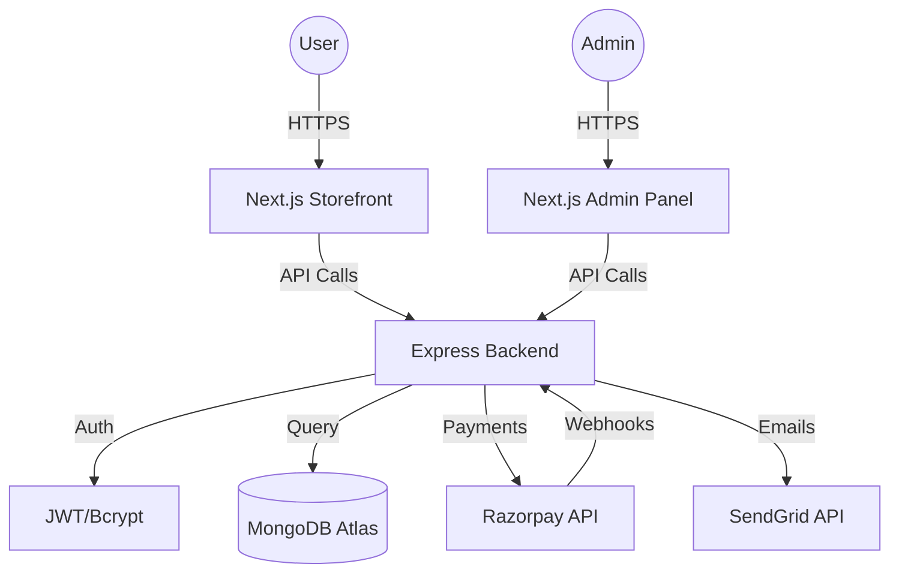

# High-Level System Architecture

**Project:** Professional E-Commerce Platform  
**Status:** FINAL ARCHITECTURE  
**Last Updated:** January 15, 2026

---

## 1. System Components Overview

The system is designed as a decoupled, full-stack application with a clear separation between the presentation layer, business logic, and data persistence.

### **A. Frontend (Customer Storefront)**
- **Technology:** Next.js (App Router)
- **Rendering:** Hybrid (SSG for products, SSR for user-specific data, CSR for interactive elements)
- **State Management:** React Context / Zustand (for Cart & Auth)
- **Styling:** Tailwind CSS (Mobile-first)

### **B. Backend (API Server)**
- **Technology:** Node.js + Express.js
- **Architecture:** MVC (Model-View-Controller) / Service-Repository Pattern
- **API Style:** RESTful JSON API
- **Validation:** Zod / Joi for request schema validation

### **C. Database (Persistence)**
- **Technology:** MongoDB Atlas (Cloud)
- **Modeling:** Mongoose ODM
- **Indexing:** Optimized for search (Product names, categories) and unique constraints (Emails, Order IDs)

### **D. Payment Gateway**
- **Provider:** Razorpay
- **Integration:** Server-side order creation + Client-side checkout + Webhook verification

### **E. Notifications & Messaging**
- **Email:** SendGrid / Nodemailer (Order confirmation, OTPs)
- **SMS:** Twilio / Msg91 (Optional, for India-specific OTPs)
- **Real-time:** Socket.io (Optional, for live order tracking updates)

---

## 2. Data Flows

### **A. Product Browsing**
1. **User** requests a category/search page.
2. **Next.js** serves a pre-rendered page (SSG) or fetches from **Backend API**.
3. **Backend** queries **MongoDB** with filters/pagination.
4. **MongoDB** returns product data.
5. **Frontend** renders products with optimized images (Next/Image).

### **B. Shopping Cart**
1. **User** adds item to cart.
2. **Frontend** updates local state (Zustand/LocalStorage) for guest users.
3. **Authenticated User:** Frontend syncs cart with **Backend API**.
4. **Backend** updates `Cart` collection in **MongoDB**.
5. **Frontend** displays real-time subtotal and item count.

### **C. Checkout & Order Creation**
1. **User** clicks "Checkout".
2. **Frontend** validates cart items and stock availability via **Backend**.
3. **Backend** creates a "Pending" order in **MongoDB** and generates a `razorpay_order_id`.
4. **Backend** returns the Order ID and Amount to Frontend.

### **D. Payment Flow (Razorpay)**
1. **Frontend** opens Razorpay Checkout modal.
2. **User** completes payment (UPI/Card/NetBanking).
3. **Razorpay** returns `payment_id` and `signature` to Frontend.
4. **Frontend** sends payment details to **Backend** for verification.
5. **Backend** verifies signature using Razorpay Secret.
6. **Backend** updates Order Status to "Paid" and triggers **Notifications**.
7. **Webhook:** Razorpay sends an asynchronous webhook to Backend to ensure status update even if user closes browser.

### **E. Order Lifecycle**
1. **Placed:** Order created, payment pending.
2. **Confirmed:** Payment verified, inventory reserved.
3. **Shipped:** Admin updates status, tracking ID added.
4. **Delivered:** Final status update, email sent to user.
5. **Cancelled/Returned:** Inventory restored, refund triggered via Razorpay API.

---

## 3. Infrastructure Diagram (Conceptual)

---

**CTO Signature:** Antigravity AI  
**Date:** January 15, 2026
